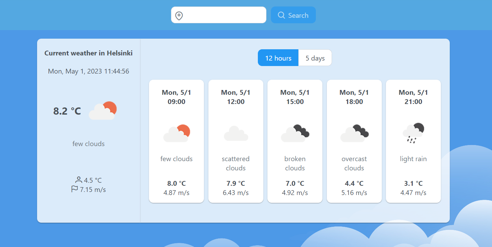

# Weather App

Web application that shows current weather and 12 hour / 5 days forecast for selected city.

Application uses [OpenWeatherMapAPI](https://openweathermap.org/api) to get coordinates for a searched city, as well as weather data for that city. Additionally, it uses [TimeZoneDB](https://timezonedb.com/api) to get current and forecasted date and time for the searched city in its respective timezone.



## Technologies and libraries used

| Tech/library | Use |
| :----: | :---: |
| [Vue.js](https://vuejs.org/) | Framework |
| [Vite](https://vitejs.dev/) | Build tool |
| [TypeScript](https://www.typescriptlang.org/) | Programming language|
| [PrimeVue](https://primevue.org/) | UI component library | 
| [PrimeIcons](https://github.com/primefaces/primeicons) | Icon library for PrimeVue |
| [Mitt](https://github.com/developit/mitt) | Event emitter |
| [Luxon](https://moment.github.io/luxon/#/) | Date and time library |


#### More detailed report of the project in Finnish: [Seminaariraportti](seminaariraportti.md)

## Getting started
### Clone project

```sh
$ git clone https://github.com/AaltonenSan/vue-weather-app.git
```

### Create environment variables

```sh
$ touch .env.local

Inside .env.local add following environment variables: 'VITE_WEATHER_API_KEY' and 'VITE_TIMEZONE_API_KEY'
You need to register to both APIs to get your own API keys
```


### Install npm packages

```sh
npm install
```

### Compile and Hot-Reload for Development

```sh
npm run dev
```

### Type-Check, Compile and Minify for Production

```sh
npm run build
```

## Recommended IDE Setup

[VSCode](https://code.visualstudio.com/) + [Volar](https://marketplace.visualstudio.com/items?itemName=Vue.volar) (and disable Vetur) + [TypeScript Vue Plugin (Volar)](https://marketplace.visualstudio.com/items?itemName=Vue.vscode-typescript-vue-plugin).

### Type Support for `.vue` Imports in TS

TypeScript cannot handle type information for `.vue` imports by default, so we replace the `tsc` CLI with `vue-tsc` for type checking. In editors, we need [TypeScript Vue Plugin (Volar)](https://marketplace.visualstudio.com/items?itemName=Vue.vscode-typescript-vue-plugin) to make the TypeScript language service aware of `.vue` types.

If the standalone TypeScript plugin doesn't feel fast enough to you, Volar has also implemented a [Take Over Mode](https://github.com/johnsoncodehk/volar/discussions/471#discussioncomment-1361669) that is more performant. You can enable it by the following steps:

1. Disable the built-in TypeScript Extension
    1) Run `Extensions: Show Built-in Extensions` from VSCode's command palette
    2) Find `TypeScript and JavaScript Language Features`, right click and select `Disable (Workspace)`
2. Reload the VSCode window by running `Developer: Reload Window` from the command palette.

## MIT License

Copyright (c) [2023] [Santeri Aaltonen]

Permission is hereby granted, free of charge, to any person obtaining a copy
of this software and associated documentation files (the "Software"), to deal
in the Software without restriction, including without limitation the rights
to use, copy, modify, merge, publish, distribute, sublicense, and/or sell
copies of the Software, and to permit persons to whom the Software is
furnished to do so, subject to the following conditions:

The above copyright notice and this permission notice shall be included in all
copies or substantial portions of the Software.

THE SOFTWARE IS PROVIDED "AS IS", WITHOUT WARRANTY OF ANY KIND, EXPRESS OR
IMPLIED, INCLUDING BUT NOT LIMITED TO THE WARRANTIES OF MERCHANTABILITY,
FITNESS FOR A PARTICULAR PURPOSE AND NONINFRINGEMENT. IN NO EVENT SHALL THE
AUTHORS OR COPYRIGHT HOLDERS BE LIABLE FOR ANY CLAIM, DAMAGES OR OTHER
LIABILITY, WHETHER IN AN ACTION OF CONTRACT, TORT OR OTHERWISE, ARISING FROM,
OUT OF OR IN CONNECTION WITH THE SOFTWARE OR THE USE OR OTHER DEALINGS IN THE
SOFTWARE.
